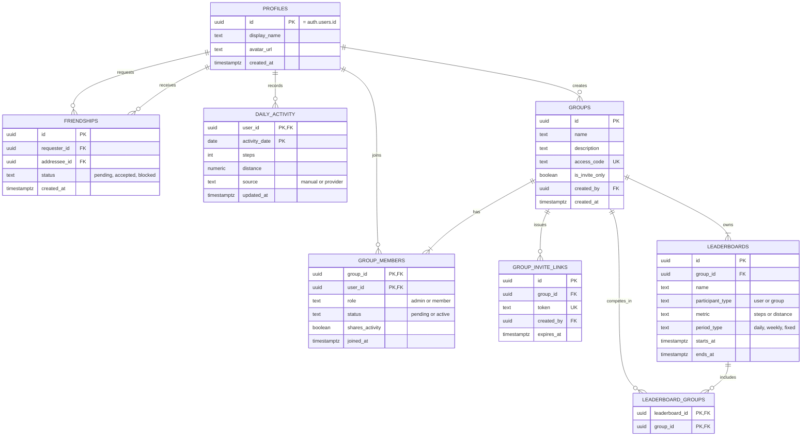

# Entity-Relationship Diagram

```mermaid
erDiagram
  PROFILES ||--o{ FRIENDSHIPS : requests
  PROFILES ||--o{ FRIENDSHIPS : receives
  PROFILES ||--o{ DAILY_ACTIVITY : records
  PROFILES ||--o{ GROUP_MEMBERS : joins
  PROFILES ||--o{ GROUPS : creates
  GROUPS ||--|{ GROUP_MEMBERS : has
  GROUPS ||--o{ GROUP_INVITE_LINKS : issues
  GROUPS ||--|{ LEADERBOARDS : owns
  GROUPS ||--o{ LEADERBOARD_GROUPS : competes_in
  LEADERBOARDS ||--o{ LEADERBOARD_GROUPS : includes

  PROFILES {
    uuid id PK "= auth.users.id"
    text display_name
    text avatar_url
    timestamptz created_at
  }
  FRIENDSHIPS {
    uuid id PK
    uuid requester_id FK
    uuid addressee_id FK
    text status "pending, accepted, blocked"
    timestamptz created_at
  }
  DAILY_ACTIVITY {
    uuid user_id PK, FK
    date activity_date PK
    int steps
    numeric distance
    text source "manual or provider"
    timestamptz updated_at
  }
  GROUPS {
    uuid id PK
    text name
    text description
    text access_code UK
    boolean is_invite_only
    uuid created_by FK
    timestamptz created_at
  }
  GROUP_MEMBERS {
    uuid group_id PK, FK
    uuid user_id PK, FK
    text role "admin or member"
    text status "pending or active"
    boolean shares_activity
    timestamptz joined_at
  }
  GROUP_INVITE_LINKS {
    uuid id PK
    uuid group_id FK
    text token UK
    uuid created_by FK
    timestamptz expires_at
  }
  LEADERBOARDS {
    uuid id PK
    uuid group_id FK
    text name
    text participant_type "user or group"
    text metric "steps or distance"
    text period_type "daily, weekly, fixed"
    timestamptz starts_at
    timestamptz ends_at
  }
  LEADERBOARD_GROUPS {
    uuid leaderboard_id PK, FK
    uuid group_id PK, FK
  }
```
